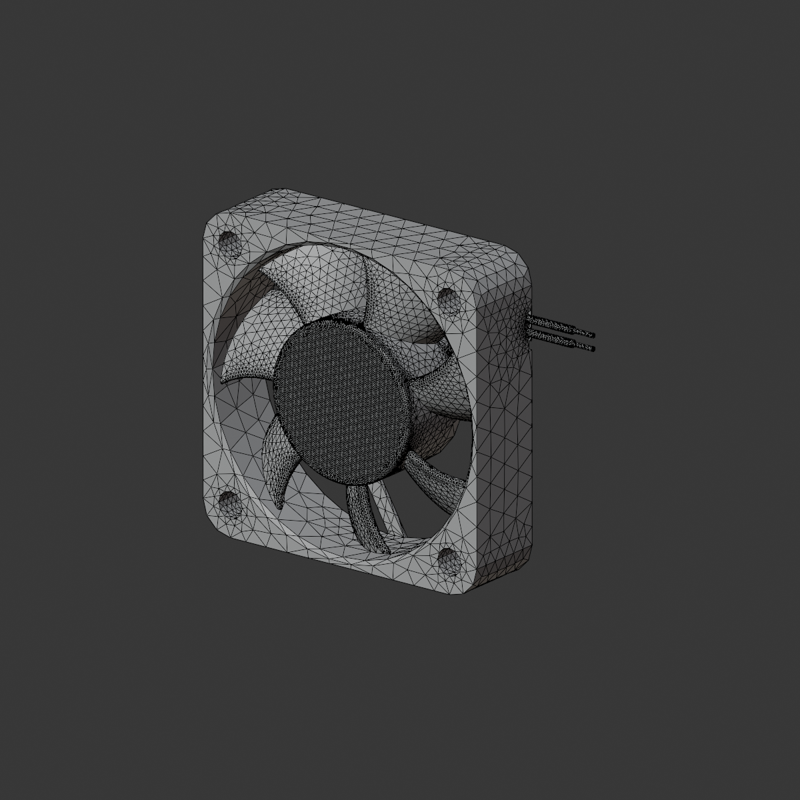
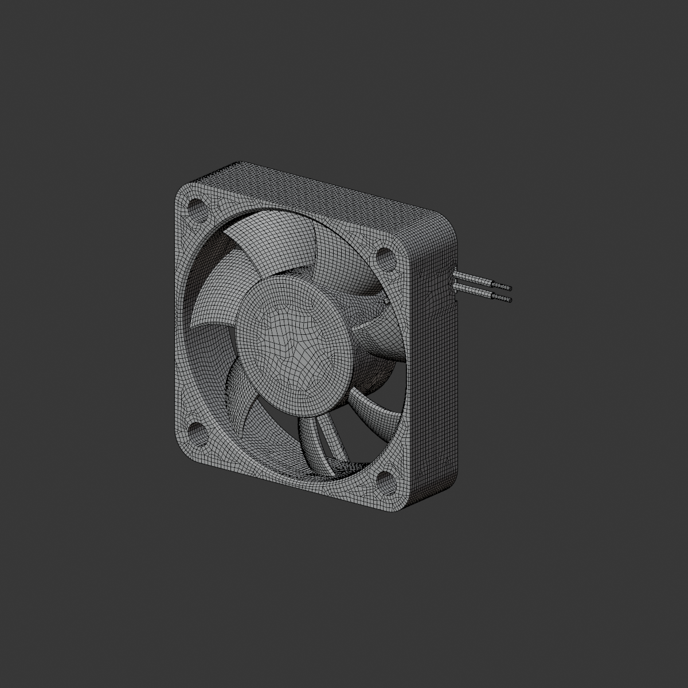
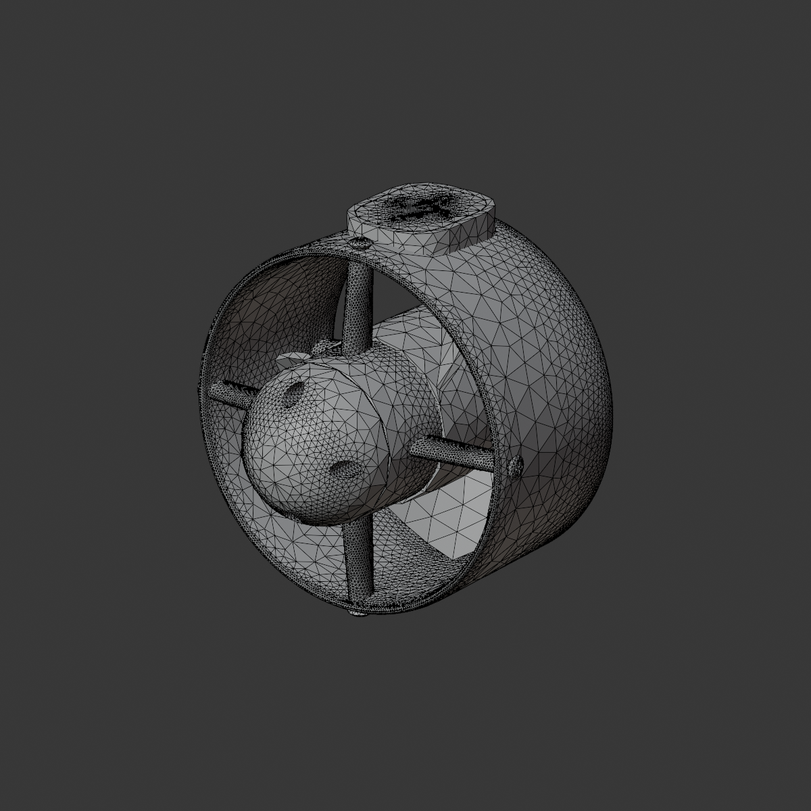
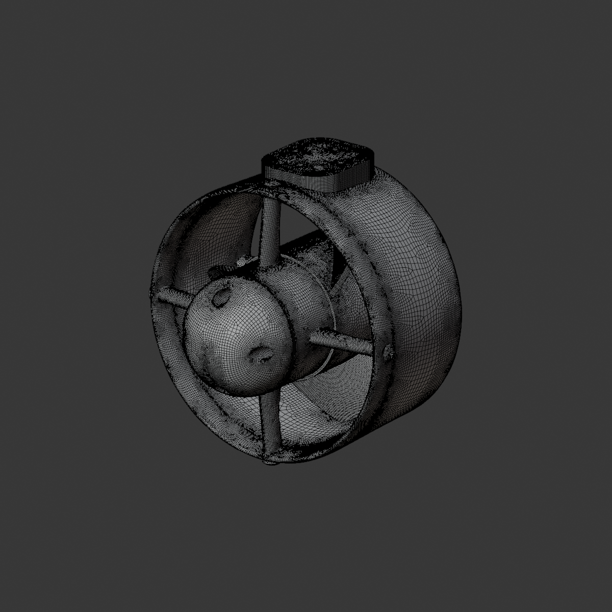
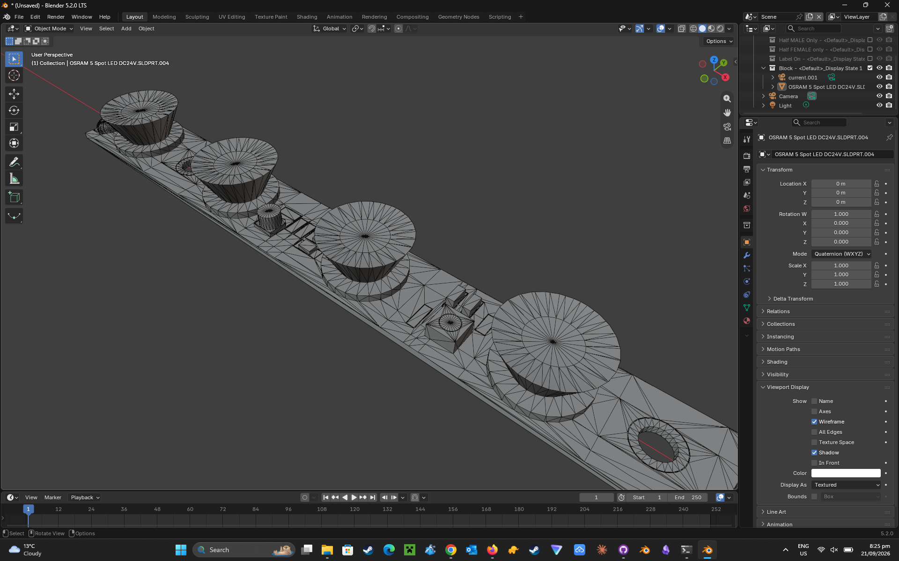
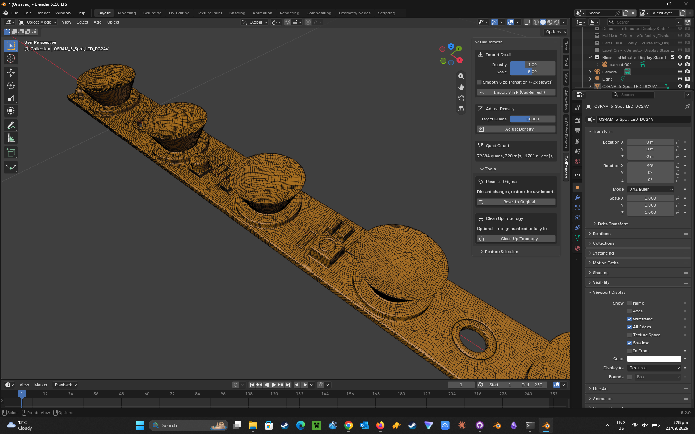
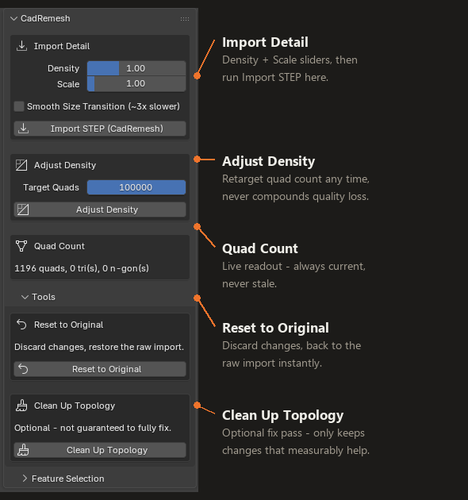

# CadRemesh

> **This repository is documentation only** — GitHub's "Download ZIP" button won't give you the
> addon, just this README and its images. **[Get the real thing here — $10 →](https://buy.stripe.com/14AdR84fkfJmfVu4tYfIs00)**

Feature-aware STEP-to-Blender quad retopology, packaged as a real Blender extension.

Every existing STEP import path for Blender works from an already-triangulated mesh — by the
time a typical retopology tool sees the geometry, the exact original CAD structure (fillets,
holes, flat faces) has already been thrown away by the tessellation step, and the tool has to
guess that structure back out of a triangle soup. CadRemesh reads the STEP file's real structure
directly and builds quad topology aligned to the actual feature boundaries, instead of
reverse-engineering it after the fact — the first packaged, one-click Blender addon built this
way. Every other Blender-side tool (Quad Remesher, Quadify, Smart Remesh) works from the
tessellated mesh.

**[View the interactive workflow guide →](https://claude.ai/artifact/RgQ9ekqZjBDWfPRjWr23X5)**

## Before / after

Same real part, same view. A typical triangulated import versus CadRemesh's output:

| Generic triangulated import | CadRemesh output |
|---|---|
|  |  |

Same comparison on a real 8-part mechanical assembly — more surface complexity, still clean quads:

| Generic triangulated import | CadRemesh output |
|---|---|
|  |  |

One more real part, same comparison — an LED light bar with round domes and fine
engraved detail:

| Generic triangulated import | CadRemesh output |
|---|---|
|  |  |

## Why it matters

Built for rendering and product animation, not game-asset poly budgets — no aggressive stripping
needed. Full density straight off Import is genuinely usable for this work, not something you
have to fight down to a workable size first.

- **Shades correctly** — quad topology reads clean under Shade Smooth, no faceting or pinched
  shading from irregular triangulation.
- **Subdivision-ready** — Catmull-Clark subdivision behaves the way it's supposed to on quads;
  triangles don't subdivide predictably.
- **Deforms better** — quad topology holds its shape more predictably under bending and
  animation than a triangulated mesh.
- **Skips the retopology tax** — most STEP imports need a manual cleanup pass before they're
  usable for a render. This one doesn't.

## What this is not

- **Not a game-asset tool.** No poly-budget optimization, no rigging-ready edge flow, no
  guaranteed topology alignment to a character or hard-surface silhouette. Game assets need
  more control over exactly where every edge loop goes than this gives you.
- **Not a UV or texturing tool.** Zero UV layers are generated. You'd unwrap manually afterward,
  same as any import.
- **Not a color-import tool.** Every part gets one shared marker material — original STEP
  per-part color data isn't read or applied.
- **Not a CAD/FEA precision tool.** Clean Up Topology's fix pass can introduce a tiny local
  position change in an already-defective zone to improve its appearance — fine for a render,
  not appropriate where exact dimensional accuracy at the mesh level matters.

## What it does

- **Import STEP** — one Blender object per real solid body in the file, correctly named from
  the STEP label where available. Multi-part assemblies are split and named automatically.
- **Adjust Density** — retarget the quad count up or down at any time, always working from a
  never-touched backup of the original full-fidelity import so repeated adjustments never
  compound quality loss.
- **Real-world scale** — imports land at correct real-world Blender units automatically,
  regardless of the source file's own unit convention.
- **Clean Up Topology** — an optional pass that improves problem areas of the mesh, only
  keeping a change when it measurably helps — otherwise it's left alone.
- **Smooth Size Transition** — an opt-in option for a more gradual, less "algorithmic-looking"
  density falloff between fine and coarse areas of the mesh.

Import and Adjust Density produce 100% quad output — no triangles or n-gons — validated against
a real 8-part mechanical assembly, a medical-grade stent at 0.055mm feature scale, and everyday
CAD parts (fans, power supplies, linear guides). Clean Up Topology is the one exception: it can
turn a small number of neighboring quads into triangles or n-gons as a side effect of removing
genuinely degenerate faces — an explicit, disclosed tradeoff of that optional step, not the
normal result.

## Installation

Requires Blender 4.2 or newer.

1. Purchase CadRemesh (see [Availability](#availability)) — you're redirected straight to your
   `.zip` download after payment, no email wait.
2. In Blender, open **Edit → Preferences → Get Extensions**, click the dropdown arrow next to
   "Install from Disk" (top right), and select the downloaded `.zip`. (Or just drag the `.zip`
   file straight into Blender's window — 4.2+ installs extensions dropped this way too.)
3. Blender enables it automatically after installing. If it doesn't, find "CadRemesh" in the
   Extensions list and switch it on.
4. In the 3D viewport, press **N** to open the sidebar and look for the **CadRemesh** tab.

## The panel

Everything lives in one N-panel tab in the 3D viewport sidebar:

## Availability

**[Buy CadRemesh — $10](https://buy.stripe.com/14AdR84fkfJmfVu4tYfIs00)**

One-time payment, no subscription. You're redirected straight to your download after payment —
delivery is automatic.

## License

GPL-2.0-or-later — required by Blender's own Python API licensing terms for any addon that
uses `bpy`. Full source is provided to purchasers along with their download.
